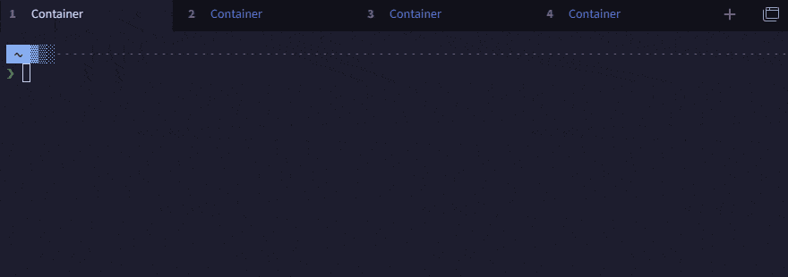

# Tabby Tab Activity Plus

Enhanced tab activity indicator for [Tabby](https://tabby.sh) — replaces the built-in blinking dot with a color-coded bottom bar that shows command execution state.



*Running a command in a background tab: breathing pulse while running → solid blue on success → solid purple on failure. Switching to the tab clears the indicator.*

## Features

| State | Indicator | When |
|-------|-----------|------|
| **Running** | 🟣 Blue-purple breathing pulse | Command executing, has output |
| **Running-idle** | 🟣 Static dim gradient bar | Command running but no output for N seconds (e.g. TUI idle) |
| **Success** | 🔵 Solid blue glow | Command finished with exit code 0 |
| **Failed** | 🟣 Solid purple glow | Command finished with non-zero exit code |
| **Fallback** | 🟣 Breathing pulse | Output detected, no shell integration |
| **Fallback-idle** | 🔵 Solid blue glow | Output stopped, unread (no shell integration) |
| **Idle** | *(hidden)* | No activity, or tab is focused |

### Behavior

- **Non-focused tab**: shows all states above
- **Focused tab**: briefly shows success/failed (auto-clears after `dismissTimeout`), hides running states
- **Switching to a tab**: clears the indicator; for running-idle, suppresses until new output arrives
- **TUI apps** (e.g. Kiro CLI): flashes while outputting, dims when idle, flashes again on new output

> This plugin hides Tabby's built-in activity indicator and progressbar.

## How It Works

The plugin uses **OSC 133** shell integration sequences to detect command lifecycle:

- `OSC 133;C` — command started (preexec)
- `OSC 133;D;{exit_code}` — command finished (precmd)

Without shell integration, it falls back to output-based detection (any output = activity).

## Installation

### From npm (recommended)

Search for `tabby-tab-activity-plus` in Tabby's **Settings → Plugins**.

### Manual

```bash
git clone https://github.com/BoosterY/tabby-tab-activity-plus.git
cd tabby-tab-activity-plus
npm install --legacy-peer-deps
npm run build

# Copy dist/index.js and package.json to Tabby's plugin directory:
# macOS:  ~/Library/Application Support/tabby/plugins/node_modules/tabby-tab-activity-plus/
# Windows: %APPDATA%/tabby/plugins/node_modules/tabby-tab-activity-plus/
# Linux:  ~/.config/tabby/plugins/node_modules/tabby-tab-activity-plus/
```

## Shell Integration Setup

Add the following to your shell config to enable full running/success/failed detection.

### Zsh (`~/.zshrc`)

```zsh
# Tabby Tab Activity Plus - Shell Integration
__tabby_activity_preexec() { printf '\e]133;C\a'; }
__tabby_activity_precmd() { printf '\e]133;D;%s\a' "$?"; }
autoload -Uz add-zsh-hook
add-zsh-hook preexec __tabby_activity_preexec
add-zsh-hook precmd __tabby_activity_precmd
```

### Bash (`~/.bashrc`)

```bash
# Tabby Tab Activity Plus - Shell Integration
source /path/to/tabby-tab-activity-plus/src/shell-integration/bash.sh
```

Or copy the snippet from [`src/shell-integration/bash.sh`](src/shell-integration/bash.sh).

> **Note:** Without shell integration, the plugin still works in fallback mode — it shows a breathing pulse whenever there's terminal output in a background tab, and a solid glow when output stops.

## Configuration

In Tabby's config file (`config.yaml`):

```yaml
tabActivityPlus:
  quietTimeout: 3           # Seconds of silence before fallback indicator settles
  dismissTimeout: 1         # Seconds before success/failed auto-clears on focused tab
  runningIdleTimeout: 5     # Seconds of no output before running → running-idle
  runningColor1: '#89b4fa'  # Primary color (blue, Catppuccin Mocha)
  runningColor2: '#cba6f7'  # Secondary color (purple, Catppuccin Mocha)
  successColor: '#89b4fa'   # Command succeeded
  failedColor: '#cba6f7'    # Command failed
  barHeight: 3              # Indicator bar height in pixels
```

All colors default to [Catppuccin Mocha](https://catppuccin.com/) palette. Override them to match your theme.

## Compatibility

- Tabby 1.0.156+
- Works on macOS, Windows, and Linux
- Works with local terminals, SSH sessions, and WSL
- Supports multiple tabs with identical titles

## License

[MIT](LICENSE)
